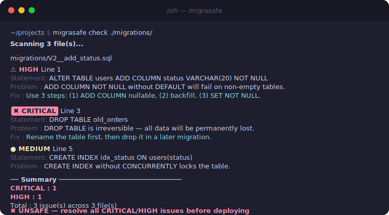
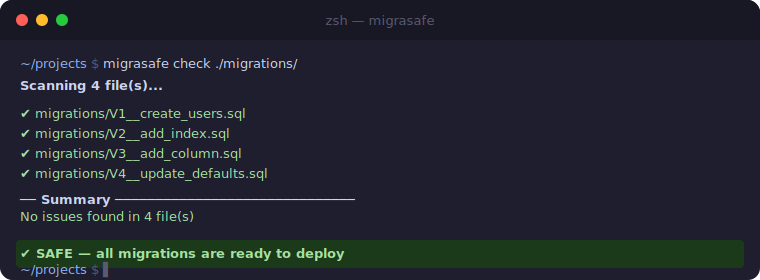

# migrasafe

> Detect unsafe SQL migrations before deploying to production.

Works in any CI pipeline. Node.js 18+.

[](https://www.npmjs.com/package/migrasafe)
[](./LICENSE)
[](https://github.com/febrifelis/migrasafe/actions/workflows/ci.yml)

---

## The Problem

Running a bad migration in production can cause data loss, table locks, or downtime — often irreversible.

```sql
-- This will lock your table for minutes on 50M rows
CREATE INDEX idx_users_email ON users(email);

-- This will wipe every row if you forget the WHERE
DELETE FROM sessions;

-- This will fail on non-empty tables
ALTER TABLE orders ADD COLUMN status VARCHAR(20) NOT NULL;
```

`migrasafe` catches these issues **before** they reach your database.

---

## Install

```bash
# Run without installing (recommended for CI)
npx migrasafe check ./migrations/

# Install globally
npm install -g migrasafe
```

**Requirements:** Node.js >= 18

---

## Quick Start

```bash
# Check a single file
migrasafe check migration.sql

# Check a directory — scans all .sql files, sorted by name
migrasafe check ./migrations/

# JSON output for scripts and dashboards
migrasafe check ./migrations/ --format json

# Only report CRITICAL and HIGH (ignore MEDIUM)
migrasafe check ./migrations/ --min-severity HIGH

# Skip files matching a pattern
migrasafe check ./migrations/ --ignore seed_ --ignore test_

# Install a git pre-commit hook
migrasafe install-hook
```

**Exit codes:** `0` = safe (no CRITICAL/HIGH), `1` = unsafe or error.

---

## Example Output

**Unsafe migration detected:**



**All migrations safe:**



<details>
<summary>Text output</summary>

```
Scanning 3 file(s)...

migrations/V2__add_status.sql
  ⚠ HIGH      Line 1
  Statement: ALTER TABLE users ADD COLUMN status VARCHAR(20) NOT NULL
  Problem  : ADD COLUMN NOT NULL without DEFAULT will fail on non-empty tables.
  Fix      : Use 3 steps: (1) ADD COLUMN nullable, (2) backfill data, (3) SET NOT NULL.

  ✖ CRITICAL  Line 2
  Statement: DROP TABLE old_orders
  Problem  : DROP TABLE is irreversible — all data will be permanently lost.
  Fix      : Use soft-delete or rename the table first, then drop it in a later migration.

── Summary ──────────────────────────────
  CRITICAL : 1
  HIGH     : 1
  Total    : 2 issue(s) across 3 file(s)

✖ UNSAFE — resolve all CRITICAL/HIGH issues before deploying
```

</details>

---

## How It Works

### 1. Write your migration

```sql
-- migrations/V3__add_user_status.sql
ALTER TABLE users ADD COLUMN status VARCHAR(20) NOT NULL;
DROP TABLE old_sessions;
CREATE INDEX idx_users_status ON users(status);
```

### 2. Run migrasafe before deploying

```bash
npx migrasafe check migrations/V3__add_user_status.sql
```

### 3. Read the output

```
Scanning 1 file(s)...

migrations/V3__add_user_status.sql
  ⚠ HIGH      Line 1
  Statement: ALTER TABLE users ADD COLUMN status VARCHAR(20) NOT NULL
  Problem  : ADD COLUMN NOT NULL without DEFAULT will fail on non-empty tables.
  Fix      : Use 3 steps: (1) ADD COLUMN nullable, (2) backfill data, (3) SET NOT NULL.

  ✖ CRITICAL  Line 2
  Statement: DROP TABLE old_sessions
  Problem  : DROP TABLE is irreversible — all data will be permanently lost.
  Fix      : Use soft-delete or rename the table first, then drop it in a later migration.

  ● MEDIUM    Line 3
  Statement: CREATE INDEX idx_users_status ON users(status)
  Problem  : CREATE INDEX without CONCURRENTLY locks the table and blocks reads/writes.
  Fix      : Use CREATE INDEX CONCURRENTLY to avoid table lock in production.

── Summary ──────────────────────────────
  CRITICAL : 1
  HIGH     : 1
  MEDIUM   : 1
  Total    : 3 issue(s) across 1 file(s)

✖ UNSAFE — resolve all CRITICAL/HIGH issues before deploying
```

### 4. Fix the issues

```sql
-- migrations/V3__add_user_status.sql (fixed)

-- ✅ Step 1: add column nullable first
ALTER TABLE users ADD COLUMN status VARCHAR(20);

-- ✅ Step 2: backfill existing rows
UPDATE users SET status = 'active' WHERE status IS NULL;

-- ✅ Step 3: now it's safe to set NOT NULL
ALTER TABLE users ALTER COLUMN status SET NOT NULL;

-- ✅ Rename instead of drop (drop in a later migration after code is deployed)
ALTER TABLE old_sessions RENAME TO old_sessions_deprecated;

-- ✅ Use CONCURRENTLY to avoid table lock
CREATE INDEX CONCURRENTLY idx_users_status ON users(status);
```

### 5. Run again — all clear

```bash
npx migrasafe check migrations/V3__add_user_status.sql

# ✔ All migrations are safe — no issues found.
# exit code: 0
```

---

## Fix Guide

Common issues and how to resolve them:

### ADD COLUMN NOT NULL without DEFAULT
```sql
-- ✖ Fails on non-empty tables
ALTER TABLE users ADD COLUMN score INTEGER NOT NULL;

-- ✅ Safe approach (3 steps)
ALTER TABLE users ADD COLUMN score INTEGER;               -- step 1: add nullable
UPDATE users SET score = 0 WHERE score IS NULL;          -- step 2: backfill
ALTER TABLE users ALTER COLUMN score SET NOT NULL;       -- step 3: enforce
```

### DELETE without WHERE
```sql
-- ✖ Wipes entire table
DELETE FROM sessions;

-- ✅ Add a WHERE clause
DELETE FROM sessions WHERE expires_at < now();

-- ✅ Or use TRUNCATE only if intentional (migrasafe will warn)
TRUNCATE sessions;
```

### UPDATE without WHERE
```sql
-- ✖ Updates every row
UPDATE users SET verified = true;

-- ✅ Add a WHERE clause
UPDATE users SET verified = true WHERE created_at < '2024-01-01';
```

### CREATE INDEX without CONCURRENTLY
```sql
-- ✖ Locks the table
CREATE INDEX idx_users_email ON users(email);

-- ✅ Non-blocking
CREATE INDEX CONCURRENTLY idx_users_email ON users(email);
```

### ALTER COLUMN TYPE
```sql
-- ✖ Fails if data cannot be cast
ALTER TABLE orders ALTER COLUMN total TYPE NUMERIC(12,2);

-- ✅ Add an explicit USING clause
ALTER TABLE orders ALTER COLUMN total TYPE NUMERIC(12,2) USING total::NUMERIC(12,2);
```

### DROP TABLE
```sql
-- ✖ Irreversible data loss
DROP TABLE old_orders;

-- ✅ Rename first, deploy, then drop in the next release
ALTER TABLE old_orders RENAME TO old_orders_deprecated;
-- (drop in a separate migration after confirming nothing references it)
```

### RENAME COLUMN
```sql
-- ✖ Breaking change — old column name disappears immediately
ALTER TABLE users RENAME COLUMN username TO user_name;

-- ✅ Safe approach (expand-contract pattern)
ALTER TABLE users ADD COLUMN user_name VARCHAR(100);     -- step 1: add new
UPDATE users SET user_name = username;                   -- step 2: copy data
-- step 3: deploy app with new column name
-- step 4: drop old column in next release
ALTER TABLE users DROP COLUMN username;
```

---

## Rules

### CRITICAL — will cause data loss or server failure

| Rule | Why |
|---|---|
| `DROP DATABASE` | Destroys the entire database and all its data permanently |
| `ALTER SYSTEM` | Modifies `postgresql.conf` directly — wrong value can make server unbootable |
| `DROP OWNED BY` | Silently drops all objects (tables, sequences, functions) owned by a role |
| `DROP TABLE` | Irreversible — all table data permanently lost |
| `DROP SCHEMA` | Irreversible — all tables, views, and data in the schema lost |
| `DROP COLUMN` | Irreversible — all column data permanently lost |
| `TRUNCATE` | Deletes every row immediately, no rollback in some configs |
| `DELETE` without `WHERE` | Deletes every row in the table |

### HIGH — will cause failures or breaking changes

| Rule | Why |
|---|---|
| `UPDATE` without `WHERE` | Modifies every row in the table |
| `RENAME TABLE` | Breaking change — all queries using the old name will fail |
| `RENAME COLUMN` | Breaking change — all queries using the old column name will fail |
| `ADD COLUMN NOT NULL` without `DEFAULT` | Fails immediately on non-empty tables |
| `ALTER COLUMN TYPE` | Fails if existing data cannot be cast to the new type |
| `ALTER COLUMN SET NOT NULL` | Fails if any existing row contains NULL |
| `ALTER TABLE DISABLE TRIGGER` | Bypasses trigger-based validation — may allow dirty data |
| `MODIFY COLUMN` *(MySQL)* | May fail if data cannot be cast to the new type |
| `CHANGE COLUMN` *(MySQL)* | Renames and/or changes type — breaking change |

### MEDIUM — may cause degraded performance or failures

| Rule | Why |
|---|---|
| `CREATE INDEX` without `CONCURRENTLY` | Locks the entire table during index build |
| `REINDEX` without `CONCURRENTLY` | Locks the index and blocks reads/writes |
| `DROP INDEX` | May degrade query performance for queries relying on it |
| `DROP CONSTRAINT` | Removes data validation — may allow dirty data |
| `ADD UNIQUE CONSTRAINT` | Fails if duplicate values already exist |
| `ADD CHECK CONSTRAINT` | Fails if existing rows violate the constraint |
| `DROP SEQUENCE` | May break auto-increment columns or application code |
| `DROP TYPE` | May break columns or functions using this type |
| `DROP DOMAIN` | May break columns or functions using this domain |
| `DROP AGGREGATE` | May break queries using this aggregate function |
| `LOCK TABLE` | Blocks all reads and writes for the duration of the lock |
| `CLUSTER` | Rewrites the entire table — holds exclusive lock throughout |
| `DETACH PARTITION` | May break queries and application code targeting the partition |
| `VACUUM FULL` | Holds an exclusive table lock for the full duration |

---

## What It Does NOT Flag

migrasafe is designed to avoid false positives. The following patterns are safe and will not trigger any rule:

```sql
-- DELETE with WHERE — safe
DELETE FROM sessions WHERE expires_at < now();

-- UPDATE with WHERE — safe
UPDATE users SET active = false WHERE last_login < '2020-01-01';

-- CREATE INDEX CONCURRENTLY — safe, no table lock
CREATE INDEX CONCURRENTLY idx_users_email ON users(email);

-- REINDEX CONCURRENTLY — safe
REINDEX INDEX CONCURRENTLY idx_users_email;

-- ADD COLUMN with DEFAULT — safe on PostgreSQL 11+
ALTER TABLE users ADD COLUMN preferences JSONB DEFAULT '{}';

-- Keywords inside string literals — ignored
INSERT INTO logs (message) VALUES ('DROP TABLE attempt blocked');

-- Keywords inside comments — ignored
-- This migration does NOT drop any table
ALTER TABLE users ADD COLUMN verified BOOLEAN DEFAULT false;

-- Dollar-quoted function bodies — body content is not executed
CREATE OR REPLACE FUNCTION cleanup() RETURNS void AS $$
BEGIN
  DELETE FROM temp_data; -- ignored, inside function body
END;
$$ LANGUAGE plpgsql;
```

---

## Inline Ignore

Suppress a rule for a single statement using a comment on the line immediately above it:

```sql
-- migrasafe-disable-next-line
DROP TABLE old_orders;
-- ↑ skips ALL rules for the next statement

-- migrasafe-disable-next-line DROP_TABLE
DROP TABLE old_orders;
-- ↑ skips only DROP_TABLE rule; other rules still apply

-- migrasafe-disable-next-line DROP_TABLE DROP_SCHEMA
DROP TABLE old_orders;
-- ↑ skips multiple rules (space or comma separated)
```

The directive applies **only to the very next SQL statement**. All subsequent statements are checked normally.

> Use inline ignore sparingly — only when you are certain the operation is safe in your specific context.

---

## CLI Reference

### `migrasafe check <target>`

Check a SQL file or directory for unsafe migrations.

| Option | Default | Description |
|---|---|---|
| `--format <text\|json>` | `text` | Output format |
| `--min-severity <level>` | `INFO` | Minimum severity to report: `CRITICAL`, `HIGH`, `MEDIUM`, `LOW`, `INFO` |
| `--ignore <pattern...>` | — | Skip files matching regex pattern(s) |
| `--dialect <dialect>` | `auto` | SQL dialect: `postgresql`, `mysql`, `auto` |

### `migrasafe rules`

List all detection rules with their severity, category, and dialect.

```bash
# List all rules
migrasafe rules

# Filter by severity
migrasafe rules --severity CRITICAL

# Filter by category: data-loss, breaking-change, performance, safety
migrasafe rules --category performance

# Filter by dialect: all, postgresql, mysql
migrasafe rules --dialect mysql

# JSON output for scripting
migrasafe rules --format json
```

### `migrasafe install-hook`

Install a git pre-commit hook that automatically runs `migrasafe` on staged `.sql` files before each commit.

```bash
migrasafe install-hook
# ✔ migrasafe pre-commit hook installed at .git/hooks/pre-commit
```

---

## Configuration File

Create `.migrasaferc.json` (or `.migrasaferc` / `migrasafe.config.json`) in your project root:

```json
{
  "ignore": ["seed_", "test_", "fixtures/"],
  "disableRules": ["LOCK_TABLE", "CLUSTER"],
  "minSeverity": "HIGH",
  "rules": {
    "TRUNCATE": { "severity": "HIGH" },
    "DROP_INDEX": { "disabled": true }
  }
}
```

| Field | Type | Description |
|---|---|---|
| `ignore` | `string[]` | Regex patterns — files matching any pattern are skipped |
| `disableRules` | `string[]` | Rule IDs to disable (shorthand for `rules.X.disabled: true`) |
| `minSeverity` | `string` | Minimum severity to report (`CRITICAL`, `HIGH`, `MEDIUM`, `LOW`, `INFO`) |
| `rules` | `object` | Per-rule overrides — change `severity` or set `disabled: true` |

CLI flags take precedence over the config file.

### Rule IDs

Use these in `disableRules`:

`DROP_DATABASE`, `ALTER_SYSTEM`, `DROP_OWNED`, `DROP_TABLE`, `DROP_SCHEMA`, `DROP_COLUMN`, `TRUNCATE`, `DELETE_WITHOUT_WHERE`, `UPDATE_WITHOUT_WHERE`, `RENAME_TABLE`, `RENAME_COLUMN`, `ADD_NOT_NULL_WITHOUT_DEFAULT`, `ALTER_COLUMN_TYPE`, `ALTER_COLUMN_SET_NOT_NULL`, `DISABLE_TRIGGER`, `MYSQL_ALTER_TABLE_MODIFY_COLUMN`, `MYSQL_ALTER_TABLE_CHANGE`, `CREATE_INDEX_WITHOUT_CONCURRENTLY`, `REINDEX_WITHOUT_CONCURRENTLY`, `DROP_INDEX`, `DROP_CONSTRAINT`, `ADD_UNIQUE_CONSTRAINT`, `ADD_CHECK_CONSTRAINT`, `DROP_SEQUENCE`, `DROP_TYPE`, `DROP_DOMAIN`, `DROP_AGGREGATE`, `LOCK_TABLE`, `CLUSTER`, `DETACH_PARTITION`, `VACUUM_FULL`

---

## CI Integration

### GitHub Actions — reusable action

```yaml
name: Check migrations

on: [push, pull_request]

jobs:
  migrate-check:
    runs-on: ubuntu-latest
    steps:
      - uses: actions/checkout@v4
      - uses: febrifelis/migrasafe@v1
        with:
          path: ./migrations
          dialect: postgresql
          min-severity: HIGH
```

Outputs available after the step:

| Output | Description |
|---|---|
| `safe` | `true` or `false` |
| `risk-score` | 0–100 |
| `risk-level` | `LOW`, `MEDIUM`, `HIGH`, `CRITICAL` |

```yaml
      - uses: febrifelis/migrasafe@v1
        id: migrasafe
        with:
          path: ./migrations
      - name: Post risk score
        run: echo "Risk score ${{ steps.migrasafe.outputs.risk-score }}/100 (${{ steps.migrasafe.outputs.risk-level }})"
```

#### Using npx (no action required)

```yaml
      - uses: actions/checkout@v4
      - name: Check migration safety
        run: npx migrasafe check ./migrations/ --dialect postgresql
```

### Docker

```bash
# Check a local migrations folder
docker run --rm -v $(pwd)/migrations:/migrations ghcr.io/febrifelis/migrasafe check /migrations

# With options
docker run --rm -v $(pwd):/app ghcr.io/febrifelis/migrasafe check /app/migrations --dialect postgresql --format json
```

Or build locally:

```bash
docker build -t migrasafe .
docker run --rm -v $(pwd)/migrations:/migrations migrasafe check /migrations
```

### GitLab CI

```yaml
check-migrations:
  image: node:20-alpine
  script:
    - npx migrasafe check ./migrations/ --dialect postgresql
  only:
    changes:
      - migrations/**/*.sql
```

### Jenkins

```groovy
pipeline {
  agent any
  stages {
    stage('Check Migrations') {
      steps {
        sh 'npx migrasafe check ./migrations/ --dialect postgresql'
      }
    }
  }
}
```

### Azure DevOps

```yaml
steps:
  - task: NodeTool@0
    inputs:
      versionSpec: '20.x'
  - script: npx migrasafe check ./migrations/ --dialect postgresql
    displayName: 'Check migration safety'
```

### Bitbucket Pipelines

```yaml
pipelines:
  default:
    - step:
        name: Check migration safety
        image: node:20-alpine
        script:
          - npx migrasafe check ./migrations/
```

### Pre-commit hook (manual)

```bash
#!/bin/sh
STAGED_SQL=$(git diff --cached --name-only --diff-filter=ACM | grep '\.sql$')
if [ -z "$STAGED_SQL" ]; then exit 0; fi
echo "$STAGED_SQL" | xargs npx migrasafe check
```

Or use the built-in installer: `migrasafe install-hook`

---

## JSON Output

Use `--format json` for structured output in scripts, dashboards, or custom reporters:

```bash
migrasafe check ./migrations/ --format json
```

```json
{
  "safe": false,
  "summary": {
    "critical": 1,
    "high": 1,
    "medium": 0,
    "total": 2
  },
  "files": [
    {
      "file": "migrations/V2__add_status.sql",
      "issueCount": 2,
      "issues": [
        {
          "severity": "HIGH",
          "line": 1,
          "statement": "ALTER TABLE users ADD COLUMN status VARCHAR(20) NOT NULL",
          "message": "ADD COLUMN NOT NULL without DEFAULT will fail on non-empty tables.",
          "suggestion": "Use 3 steps: (1) ADD COLUMN nullable, (2) backfill data, (3) SET NOT NULL."
        },
        {
          "severity": "CRITICAL",
          "line": 2,
          "statement": "DROP TABLE old_orders",
          "message": "DROP TABLE is irreversible — all data will be permanently lost.",
          "suggestion": "Use soft-delete or rename the table first, then drop it in a later migration."
        }
      ]
    }
  ]
}
```

---

## Works With

migrasafe understands standard SQL and PostgreSQL extensions out of the box:

- **Migration tools:** Flyway, Liquibase, golang-migrate, Alembic, Sqitch, Prisma
- **Databases:** PostgreSQL (full support), MySQL/MariaDB (core rules + MODIFY/CHANGE COLUMN)
- **SQL features handled correctly:** dollar-quoted strings (`$$`), single/double-quoted literals, line comments (`--`), block comments (`/* */`), CTEs, subqueries, stored procedures, CRLF line endings, UTF-8 BOM

### Dialect mode

Use `--dialect` to apply only rules relevant to your database engine:

```bash
# Only check rules that apply to PostgreSQL
npx migrasafe check ./migrations/ --dialect postgresql

# Only check rules that apply to MySQL/MariaDB
npx migrasafe check ./migrations/ --dialect mysql

# Auto-detect from SQL content (default)
npx migrasafe check ./migrations/ --dialect auto
```

Or set it in your config file:

```json
{ "dialect": "postgresql" }
```

In `auto` mode, migrasafe detects the dialect from signals in the SQL content (e.g. `$$`, `RETURNING`, `SERIAL` for PostgreSQL; backticks, `AUTO_INCREMENT`, `ENGINE=` for MySQL).

---

## Security

- **No network access** — runs entirely offline
- **Read-only** — never writes to your database or files
- **No shell execution** — no `exec()` or `eval()`
- **File size limit** — rejects files over 10 MB to prevent OOM
- **Binary file guard** — skips non-text files automatically
- **Symlink protection** — skips symlinks in directory scans
- **Statement limit** — rejects files with more than 10,000 statements

---

## Contributing

See [CONTRIBUTING.md](./CONTRIBUTING.md) for how to add rules, write tests, and submit pull requests.

---

## License

[MIT](./LICENSE) © [febrifelis](https://github.com/febrifelis)
